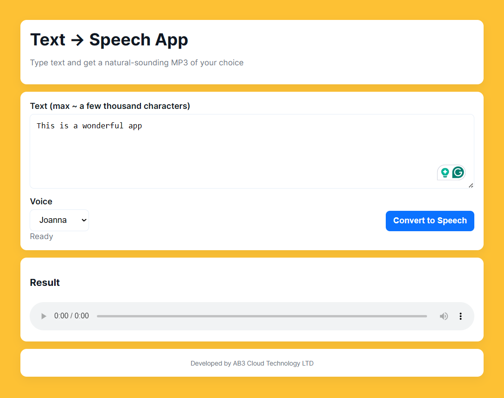
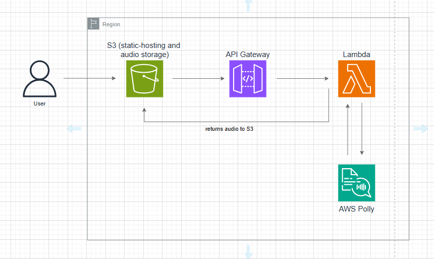

# Text-to-Speech on AWS (Terraform Project)



This project provisions a **Text-to-Speech web app** on AWS using Terraform.  
It deploys:
- An **S3 bucket** (for static frontend + audio files storage)
- An **AWS Lambda** function (Polly text-to-speech)
- An **API Gateway** (for invoking Lambda from frontend)
- Required **IAM roles/policies**

---

## Prerequisites

- [Terraform ≥ 1.5](https://developer.hashicorp.com/terraform/downloads)
- [AWS Account](https://aws.amazon.com/console/)
- [VS Code](https://code.visualstudio.com/download)
- AWS CLI configured with admin permissions

---

## Architecture Diagram Walkthrough

- Host the frontend (html + css + js) on S3 with enabled static hosting
- A user makes a call to convert text to speech and the call is sent to API Gateway. 
- The API Gateway triggers a lambda function. The function sends the text (user input) to AWS Polly for synthesis and stores the audio file in a directory in the same S3 bucket
- The audio is sent back to the frontend for the user to listen to it
- S3 lifecycle is add to delete audio after 1 day to optimise cost

---
## Project Structure
```bash
text-to-speech-application/
├── Terraform/
│   ├── main.tf
│   ├── variables.tf
│   ├── outputs.tf
│   ├── modules/
│   │   ├── s3/
│   │   │   ├── main.tf
│   │   │   ├── variables.tf
│   │   │   └── outputs.tf
│   │   ├── lambda/
│   │   │   ├── main.tf
│   │   │   ├── variables.tf
│   │   │   └── outputs.tf
│   │   └── api/
│   │       ├── main.tf
│   │       ├── variables.tf
│   │       └── outputs.tf
│   └── lambda/       
│        └── handler.py
├── ProjectFiles/
│   ├── frontend/
│   │   ├── index.html
│   │   ├── styles.css
│   │   └── app.js
│   ├── architecture-diagram.png
│   └── Testing session.mp4
├── .gitignore
├── README.md


```
---
## Project Walkthrough
1. cd into the Terraform folder
```bash
cd Terraform/
```

2. Initialise
```bash
terraform init
```

3. Validate syntax
```bash
terraform validate
```

4. Plan
```bash
terraform plan -out=tfplan
```

5. Apply the desired states
```bash
terraform apply "tfplan"
```

6. Copy the api_endpoint link and paste it into the index.html file line 58. That is where you have the window.API_BASE

7. upload the all files in the frontend directory in the s3-bucket. Create a folder "audio" in the same bucket for storing the generated audio files
```bash
aws s3 cp ../ProjectFiles/frontend/ s3://ab3-text-to-speech-tf/ --recursive
aws s3api put-object --bucket ab3-text-to-speech-tf --key audio/
```
verify uploads
```bash
aws s3 ls s3://ab3-text-to-speech-tf/
# you should see:
# audio/
# index.html
# styles.css
# app.js

# if it doesn't work, upload manually via console

```

8. copy and paste the s3 website_endpoint from the terraform apply output into a web browser and enjoy the application
```bash
http://ab3-text-to-speech-tf.s3.us-east-1.amazonaws.com
```
9. Clean up
```bash
terraform destroy
```
---
## Challenges Faced
- Provisioning of the Lambda function and pointing the handler to the right file (file mapping)
- API integration (CORS)